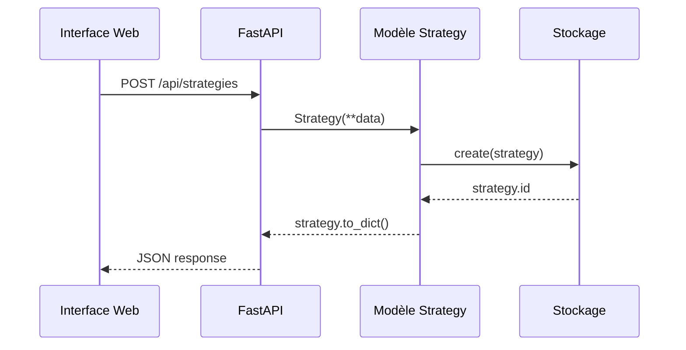

# 📁 Architecture du Projet

Découvrez l'architecture technique de Multi-Orchestrator-Bot et ses principes de conception.

## Architecture générale

### Pattern architectural

Multi-Orchestrator-Bot suit une architecture **modulaire en couches** :

```
┌─────────────────┐
│   Interface Web │  ← HTML/CSS/JS vanilla
├─────────────────┤
│     API REST    │  ← FastAPI + Pydantic
├─────────────────┤
│   Logique Métier│  ← Services + Modèles
├─────────────────┤
│    Stockage     │  ← In-memory (extensible)
└─────────────────┘
```

### Séparation des responsabilités

- **Interface (static/)** : Présentation et interaction utilisateur
- **API (src/api.py)** : Contrôleur REST et validation
- **Modèles (src/models.py)** : Structures de données métier
- **Stockage (src/storage.py)** : Persistance des données
- **Application (src/main.py)** : Configuration et orchestration

## Structure des modules

### Détail de src/

```
src/
├── __init__.py          # Module Python
├── main.py             # Point d'entrée FastAPI
│                       # - Configuration serveur
│                       # - Middlewares CORS
│                       # - Routes statiques
│                       # - Gestion du cycle de vie
├── api.py              # Routes API REST
│                       # - Endpoints CRUD
│                       # - Validation Pydantic
│                       # - Gestion d'erreurs
├── models.py           # Modèles de données
│                       # - dataclasses Python
│                       # - Méthodes métier
│                       # - Sérialisation JSON
└── storage.py          # Stockage en mémoire
    # - Collections thread-safe
    # - CRUD générique
    # - Données d'exemple
```

### Interface web (static/)

```
static/
├── index.html         # Page principale
├── css/
│   └── style.css      # Styles responsive
└── js/
    └── app.js         # Logique frontend
        # - Gestion d'état
        # - Appels API
        # - Interface utilisateur
```

## Flux de données

### Cycle de requête complet

```
1. Interface Web → 2. API FastAPI → 3. Service Métier → 4. Stockage
    ↑                    ↓                    ↓                    ↓
5. Réponse ← 6. JSON ← 7. Objet ← 8. Données sérialisées
```

### Exemple concret : Création d'une stratégie



## Principes de conception

### 1. Séparation claire des couches

Chaque couche a une responsabilité unique :

- **Interface** : Présentation uniquement
- **API** : Contrôle et validation
- **Modèles** : Logique métier
- **Stockage** : Persistance des données

### 2. Interfaces bien définies

```python
# Interface claire entre couches
class InMemoryStorage(Generic[T]):
    def create(self, item: T) -> T: ...
    def get(self, item_id: int) -> Optional[T]: ...
    def update(self, item_id: int, item: T) -> Optional[T]: ...
    def delete(self, item_id: int) -> bool: ...
```

### 3. Types forts et validation

```python
# Validation automatique avec Pydantic
class StrategyCreate(BaseModel):
    name: str = Field(..., min_length=1, max_length=255)
    type: str = Field(..., pattern=r'^(rsi|macd|ml|manual)$')
```

### 4. Testabilité

Chaque couche peut être testée indépendamment :

- **Tests unitaires** : Modèles et logique métier
- **Tests d'intégration** : API complète
- **Tests end-to-end** : Interface utilisateur

## 🔧 Technologies choisies

### FastAPI - Framework API moderne

**Avantages :**
- Performance élevée 
- Validation automatique des données
- Support async/await natif

**Utilisation :**
```python
@app.get("/strategies")
def get_strategies() -> List[dict]:
    return strategies_storage.get_all()
```

### Dataclasses Python - Modèles simples

**Avantages :**
- Syntaxe concise et lisible
- Génération automatique de méthodes
- Support natif du typage
- Performance optimale

**Utilisation :**
```python
@dataclass
class Strategy(BaseModel):
    name: str
    type: str = "manual"
    status: str = "inactive"
```

### Stockage en mémoire thread-safe

**Avantages :**
- Simplicité de développement
- Pas de dépendances externes
- Performance optimale
- Extensible vers bases de données

**Implémentation :**
```python
class InMemoryStorage(Generic[T]):
    def __init__(self):
        self._data: Dict[int, T] = {}
        self._lock = Lock()
```

## Évolutivité

### Extension facile

L'architecture permet d'ajouter facilement :

- **Nouveaux endpoints API** : Ajouter dans `api.py`
- **Nouveaux modèles** : Étendre `models.py`
- **Nouveau stockage** : Implémenter l'interface `InMemoryStorage`
- **Nouvelles fonctionnalités UI** : Modifier `static/`

### Migration vers base de données

Le stockage actuel peut être remplacé par :

```python
# Remplacement transparent
from sqlalchemy_storage import SQLAlchemyStorage
strategies_storage = SQLAlchemyStorage[Strategy]()

# Interface identique, implémentation différente
```

### Microservices

L'architecture REST permet une séparation future :

```
API Gateway → Service Stratégies
            → Service Trades
            → Service Marché
```

## Métriques et monitoring

### Points de monitoring

- **Performance API** : Temps de réponse, taux d'erreur
- **Utilisation mémoire** : Stockage en mémoire
- **Santé système** : Endpoint `/health`
- **Logs applicatifs** : Niveaux configurables

### Métriques exposées

```json
{
  "total_strategies": 5,
  "active_strategies": 2,
  "total_trades": 150,
  "open_positions": 3,
  "memory_usage": "45MB"
}
```

## 🔒 Sécurité

### Mesures implémentées

- **Validation stricte** : Pydantic pour toutes les entrées
- **CORS configuré** : Origines autorisées en développement
- **Logs sécurisés** : Pas de données sensibles
- **Rate limiting** : Via reverse proxy (nginx)

### Bonnes pratiques

- **Principe du moindre privilège**
- **Validation en profondeur**
- **Gestion d'erreurs sécurisée**
- **Audit logging**

## Décisions architecturales

### Pourquoi FastAPI plutôt que Django/Flask ?

- **Performance** : Async natif, rapidité comparable à Go
- **Développement** : Auto-complétion, validation automatique
- **Documentation** : OpenAPI générée automatiquement
- **Écosystème** : Adoption croissante, communauté active

### Pourquoi stockage en mémoire plutôt que base de données ?

- **Simplicité** : Pas de configuration complexe pour développement
- **Performance** : Accès instantané aux données
- **Éducatif** : Focus sur la logique métier
- **Extensible** : Interface claire pour migration future

### Pourquoi HTML/CSS/JS vanilla plutôt que framework ?

- **Léger** : Pas de dépendances, chargement rapide
- **Contrôle total** : Architecture personnalisée
- **Maintenance** : Code simple et compréhensible
- **Performance** : JavaScript natif optimisé

---

**Prochaine lecture** : [Documentation API](api.md)
